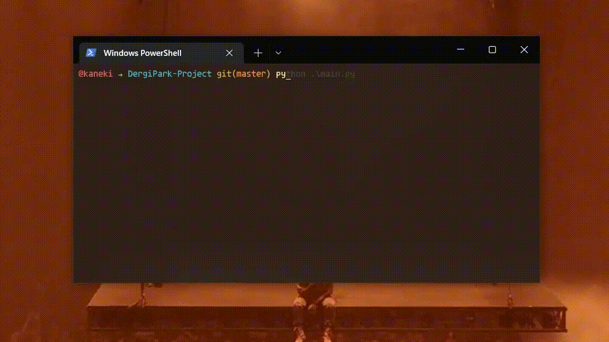
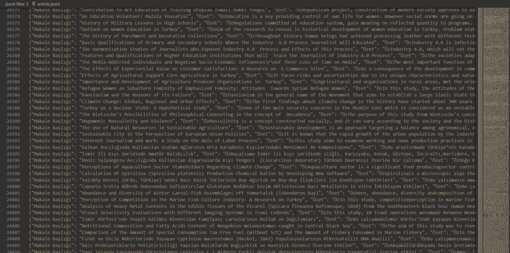
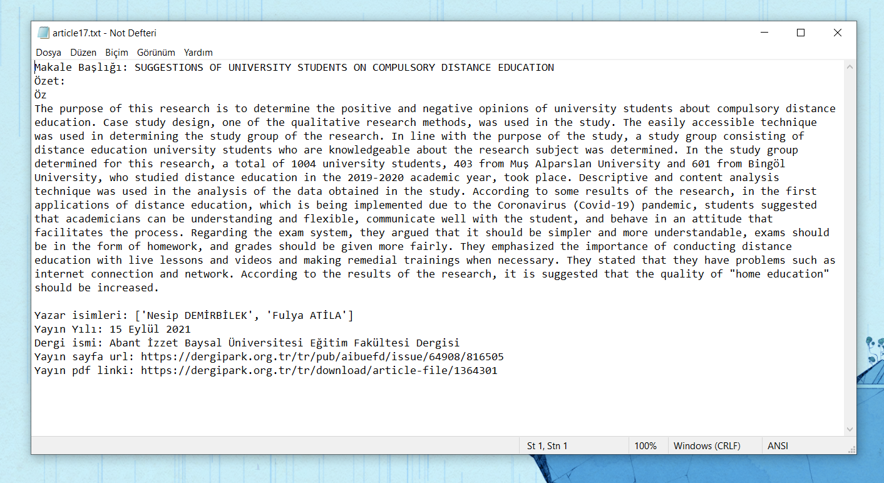

<h1 align=center> DergiPark Project </h1>

<p align=center>  </p>

<h2> Description </h2>

[DergiPark](https://dergipark.org.tr/tr/) is one of the biggest websites that provides electronic hosting for academic peer-reviewed articles in Turkey.
In this project, I extracted all articles from DergiPark and parsed the data in 8 main headings.
Afterwards, I outputted that data into different formats of files like .jsonl (JSON lines) and .txt (Text).
Complete Data-Set is available in the [DergiPark-Data-Set](https://www.github.com/Alperencode/DergiPark-Data-Set) repository.
The number of formats can be increased by customizing the source code.

&emsp; DergiPark currently has over 25.000 academic articles.
I extracted them all through [Web Scraping](https://www.edureka.co/blog/web-scraping-with-python/#:~:text=Web%20scraping%20is%20an%20automated,or%20writing%20your%20own%20code.) with Python.
Web Scraping is basically extracting a big amount of data from a specific website by reaching its source codes and parsing the tags.

&emsp; The data that I extracted can be used in Ai models to give meaning to this data or train any model with them. 
Because the data is academic peer-reviewed articles this data can be used in any formal project.

<br>

<h2> Used Techs </h2>

I used Python as a main programming language.

&emsp; For Web scraping, I used 'BeautifulSoup' and 'request' modules.
Except for these I used 'json', 'os' and 'time' for outputting the data and waiting sections.

<br>

<h2> Installation </h2>

<h3> 1) Download </h3>
<hr>

Download the project as an executable file from [Releases](https://github.com/Alperencode/DergiPark-Project/releases) and run the `DergiPark.exe` file.

<br>

<h3> 2) Clone </h3>
<hr>

Clone the project

```bash
git clone https://github.com/Alperencode/DergiPark-Project
```

Go to the project directory

```bash
cd DergiPark-Project
```

Install the required modules

```bash
pip install -r requirements.txt
```

Run the python file

```bash
python main.py
```

<br>

<h2> Usage/Examples </h2>

Run main.py in root directory 

```bash
python main.py
```

Example of proper working


<br>


<h2> Screenshots </h2>

Screenshot from JSON line data



<br>

Screenshot from txt data



<br>

<h2> Related </h2>

- [BeautifulSoup](https://github.com/Alperencode/BeautifulSoup): My other Web Scraping projects

- [Python](https://github.com/Alperencode/Python): My main Python repository

- [Algorithm-Solutions](https://github.com/Alperencode/Algorithm-Solutions): My algorithm problem solutions with python (Leetcode, HackerRank, CodeWars)

<br>

<h2> Authors </h2>

- [Alperen Aga](https://www.github.com/Alperencode)